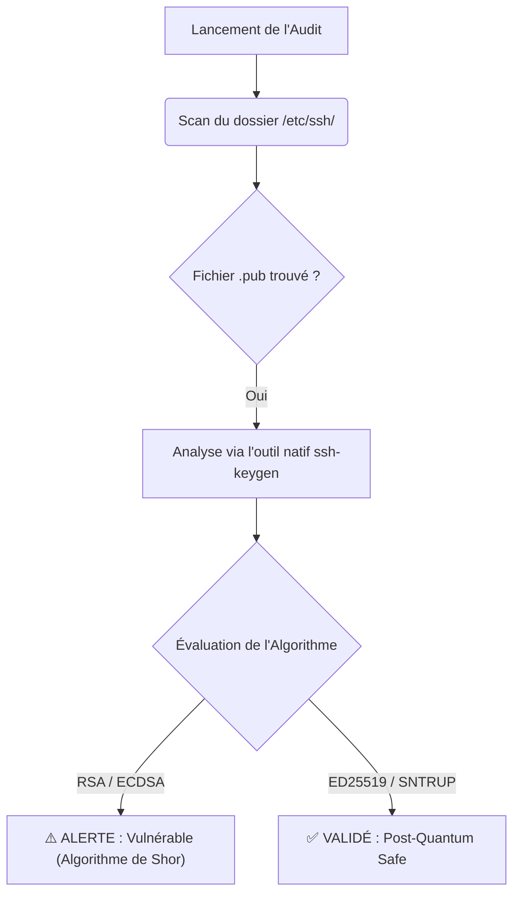

#  Post-Quantum Cryptography (PQC) SSH Auditor

Avec l'avènement des ordinateurs quantiques, les algorithmes de chiffrement asymétriques traditionnels (RSA, ECDSA) sont amenés à devenir obsolètes (brisables via l'algorithme de Shor). 

Ce script d'audit (idéal pour les équipes SecOps/SRE) scanne automatiquement les clés SSH publiques de vos serveurs Linux pour évaluer leur "Quantum Readiness". Il identifie les clés vulnérables et valide la présence d'algorithmes hybrides ou post-quantiques (ex: `ssh-ed25519` ou `sntrup761x25519-sha512@openssh.com`).

## 🏗️ Flux de l'Audit Cryptographique



# Fonctionnalités
Zéro Dépendance : Utilise exclusivement la bibliothèque standard Python et les binaires natifs de l'OS (aucun pip install requis).

Précision absolue : Ne fait pas de parsing de texte hasardeux, mais interroge directement le moteur mathématique de ssh-keygen.

Orienté Automatisation : Sortie standard (stdout) propre, facile à filtrer avec un grep ou à intégrer dans un pipeline CI/CD.

# Installation & Utilisation
Clonez le dépôt et exécutez directement le script. Privilèges root ou sudo recommandés si votre dossier /etc/ssh/ a des droits restreints.

```bash
git clone https://github.com/FilouCosmos/pqc-ssh-auditor.git
cd pqc-ssh-auditor
sudo python3 pqc_auditor.py
```

# Audit Mensuel (Cron)
Pour surveiller la conformité cryptographique de votre parc sur le long terme, ajoutez ce check mensuel dans votre crontab (crontab -e) :

```bash
0 0 1 * * /usr/bin/python3 /chemin/vers/pqc-ssh-auditor/pqc_auditor.py > /var/log/pqc_audit.log
```
